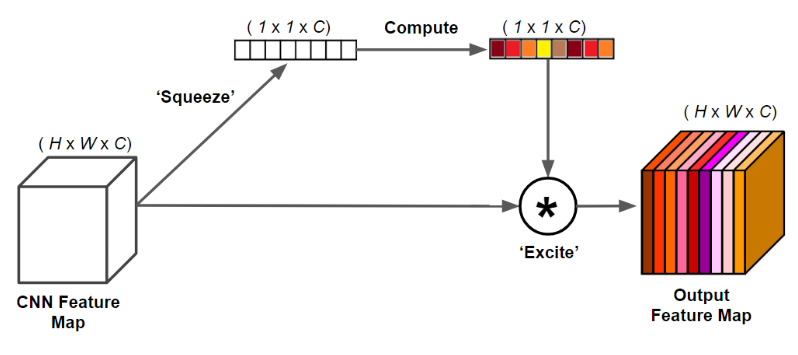

# Graph Neural Networks for EEG Emotion Recognition

**A controlled comparison of three graph-neural-network paradigms for cross-subject affect decoding on the SEED dataset.**

> Master's thesis, University of Zagreb (FER) — *Klasifikacija emocija iz EEG signala korištenjem neuronskih mreža temeljenih na grafovima* — Ivan Kušeta, mentor doc. dr. sc. Nikolina Frid. The thesis is in Croatian; its full text is archived on the University's public thesis repositories — [Repozitorij FER-a](https://repozitorij.fer.unizg.hr/) and the [National Repository of Theses (ZIR)](https://zir.nsk.hr/) — searchable by author. (The PDF is intentionally not committed to this code repository.)

This repository treats the EEG electrode montage as a **graph** (electrodes = nodes, functional/spatial relationships = edges) and asks a focused scientific question: **how does the strength of a model's structural prior trade off against its ability to generalize across people?** It implements and rigorously compares three architectures along that spectrum, under two evaluation protocols, with a controlled ablation of the feature set and attention modules.

> **For a reviewer with no EEG background and no Croatian:** the thesis is written in Croatian, so this README, the source code, and the git history are the complete scientific record. [§3 (Background primer)](#3-background-a-60-second-primer-for-non-eeg-readers) gives the EEG vocabulary you need; [§6 (Author's contribution)](#6-authors-exact-contribution) states exactly which parts are standard/borrowed versus original to this work; [§7 (Reproduce it)](#7-reproduce-it) is a complete recipe from data access to outputs.

> **Three documents, one project** (so the two long Markdown files don't confuse you): this **README** is the reference manual — what the project is, how to run it, what the results mean. **[RESEARCH_HISTORY.md](RESEARCH_HISTORY.md)** is the eight-week research narrative — every framework that was tried and discarded, and *why*; i.e. how the final architecture was actually found. **[docs/architecture_map.md](docs/architecture_map.md)** is the visual pipeline-and-model map.

---

## 1. Overview

- **Task.** 3-class emotion classification (Negative / Neutral / Positive) from Differential-Entropy (DE) EEG features on **SEED** (62 channels, 15 subjects, 3 sessions).
- **Question.** Static physical prior vs. learned topology vs. local aggregation — which generalizes, and at what cost?
- **Contribution.** Not a single "best model," but a **comparison** that surfaces *non-uniform* interactions: the attention (SE) block helps one architecture and hurts another; the variance feature is decisive for two models and irrelevant to a third; shorter windows buy stability but not always accuracy.

The study's first phase (an end-to-end CNN-GCN on the *raw* signal) reached only **35–36%** (≈ chance), which motivated the pivot to spectral DE features — itself a reported result.

## 2. At a glance

| | |
|---|---|
| **Dataset** | SEED (SJTU BCMI Lab) — 15 subjects × 3 sessions × 15 film-clip trials, 62-channel EEG |
| **Input** | Differential-Entropy features over 5 bands (+ optional rolling-variance channel) → 5 or 10 features per electrode |
| **Models** | `GCN_DE` (static k-NN graph) · `Adaptive_DGCNN` (learned + static hybrid) · `GraphSAGE` (inductive local aggregation) |
| **Protocols** | LOSO (Leave-One-Subject-Out, cross-subject) and Session-Holdout (within-subject, across sessions) |
| **Best result** | GCN_DE: **82.3% LOSO** / 84.0% Session-Holdout (1 s windows) |
| **Headline finding** | The static physical prior transfers best; learning the graph buys *stability*, not peak accuracy |
| **Stack** | Python ≥ 3.10, PyTorch, PyTorch-Geometric; CUDA GPU recommended |

> **Naming.** In prose and in output-folder names the three models are `GCN_DE` / `Adaptive_DGCNN` / `GraphSAGE`, while the corresponding `--model_type` tokens you type are `GCN` / `ADAPTIVE_DGCNN` / `GraphSAGE`; the `_DE` suffix marks the differential-entropy feature set and appears only in output paths like `GCN_DE_1s` — it is not part of the command-line flag.

## 3. Background: a 60-second primer for non-EEG readers

<details>
<summary><b>What is SEED, DE, LDS, and why is an electrode montage a graph?</b> (click to expand)</summary>

- **SEED** is a benchmark affective-computing dataset from the SJTU BCMI Lab. Fifteen subjects each watched emotional **film clips** while a **62-channel EEG** cap recorded their brain activity, repeated over **3 sessions** on different days. Each session has 15 trials labelled **negative / neutral / positive** — a balanced 3-class problem.
- **EEG** measures scalp electrical potentials. It is noisy, non-stationary, and varies strongly between people (skull thickness, electrode contact), which is precisely why *cross-subject* generalization is hard and interesting.
- **Differential Entropy (DE)** is the standard SEED feature. The raw signal is band-pass filtered into 5 canonical bands — **Delta (1–4 Hz), Theta (4–8), Alpha (8–13), Beta (13–30), Gamma (30–50)** — and for each channel/band a DE value is computed. For a band-limited Gaussian signal, `DE = 0.5·ln(2πe·σ²)`, i.e. a **log-power-like** feature that is far more session-stable than the raw waveform.
- **LDS (Linear Dynamic System) smoothing** is a Kalman-filter pass applied along time to the DE sequence; it removes emotion-irrelevant fast fluctuations. SEED ships these as the `de_LDS*` arrays this repo consumes.
- **Why a graph?** The electrodes sit at fixed positions on the scalp and brain regions interact, so the montage is *naturally* a graph: **electrodes = nodes**, each carrying a DE feature vector, and **edges** encode spatial/functional proximity. Graph neural networks are the natural model class for this structure — which is the premise of the whole study.

</details>

## 4. Headline results

Mean accuracy (%), 1-second windows, best configuration per model:

| Architecture | Structural prior | Session-Holdout | LOSO | LOSO σ | SH→LOSO drop |
|---|---|---:|---:|---:|---:|
| **GCN\_DE** | static physical k-NN graph | 84.0 | **82.3** | 5.43 | **1.69** |
| **Adaptive\_DGCNN** | learned + static (hybrid) | 81.0 | 77.5 | **4.63** | 3.51 |
| **GraphSAGE** | local inductive aggregation | 83.0 | 76.9 | 6.02 | 6.13 |

**LOSO** = Leave-One-Subject-Out (train on 14 subjects, test on the unseen 15th). The **SH→LOSO drop** is the cross-subject generalization gap — the quantity that matters most for transfer.

**What the comparison shows** (see [§9](#9-results--interpretation)): the *static physical prior* is hard to beat and transfers best; learning the graph (DGCNN) buys **stability**, not peak accuracy; purely local aggregation (SAGE) transfers worst. Positive-class F1 is ~0.92 across all models, while **neutral↔negative separation** (F1 as low as 0.62) is the universal failure mode.

**Reproducing these numbers.** The table reports **mean accuracy**: for LOSO it is the mean over the 15 leave-one-subject-out folds (σ = the across-fold spread), and for Session-Holdout it is a single train-on-S1+S2 / test-on-S3 run. The headline **GCN_DE / LOSO** row is produced by the default command — `eeg-gnn-train --model_type GCN --window_size 1s --mode sub_indep` (10 features, SE on); the other two rows are the same command with `--model_type ADAPTIVE_DGCNN` or `--model_type GraphSAGE`, each at its own best configuration (the per-model SE / feature settings are detailed in [§9](#9-results--interpretation) and the thesis, not asserted here). **Runs are not seeded**, so reproduction is statistical, not bit-exact: expect run-to-run variation around the reported means, of the order of the σ column, rather than identical digits.

## 5. Architecture


**End-to-end flow.** Pre-computed LDS-smoothed DE features (optionally augmented with a rolling-variance channel) → per-(subject, session) z-scoring → a shared calibration/attention **front-end** (AGLI → optional SE) → one of three **GNN backbones** that model inter-channel structure → an **attentional read-out** that pools nodes into a graph embedding → a linear classifier whose logits receive a **per-subject bias** → 3-class prediction.

Each model shares the calibration/attention front-end and differs in how it models inter-channel structure:

| Block | Role |
|---|---|
| **AGLI** (Adaptive Graph Input Layer) | Learnable per-(channel, band) affine `x·γ + β`; a strong L2 penalty on `γ` lets the model **silence unreliable sensors** (`γ → 0`). |
| **SE** (Squeeze-and-Excitation) | Attention-pooled recalibration of frequency bands — a *regulator* that helps when data/dimensionality is sufficient and can hurt when it is not. |
| **Subject Bias** | A per-subject embedding added to the logits, absorbing each recording's baseline offset to find a common decision boundary. |
| **Attentional aggregation** | Gated read-out (vs. mean pooling) that down-weights artifact electrodes. |

The three architectures:

- **`GCN_DE`** — spectral `GCNConv` over a *fixed* k-NN graph (k=5) built from the 10–20 montage geometry. Strongest prior; least dependent on feature engineering.
- **`Adaptive_DGCNN`** — learns a *dynamic* adjacency via query/key attention and blends it with the static prior through a learnable `α` (`A = (1−α)·A_static + α·A_dyn`). Highest LOSO stability.
- **`GraphSAGE`** — inductive local neighbourhood aggregation (max aggregator); no spectral convolution.

 

## 6. Author's exact contribution

> The job posting asks for "the code you wrote and your exact contribution." This section separates what is **standard / borrowed** (and properly credited) from what is **original to this thesis**. Every item below was checked against the source files in `src/eeg_gnn/`; see the per-item file pointers.

### Standard / borrowed (credited)

| Component | Source |
|---|---|
| The **SEED dataset** and its LDS-smoothed **DE features** | Zheng & Lu, 2015 (SJTU BCMI Lab) — the `de_LDS*` arrays are consumed as distributed. |
| Base **graph-convolution operators** — `GCNConv`, `DenseGCNConv`, `SAGEConv` — and the **attentional-aggregation / global-attention** pooling primitives | [PyTorch-Geometric](https://pytorch-geometric.readthedocs.io/) (imported directly in `src/eeg_gnn/models/*.py`). |
| The general **DGCNN "dynamic adjacency"** idea (learn a graph via self-attention `QKᵀ`) | Prior EEG-DGCNN literature; this repo provides its own implementation of the concept. |
| The **Squeeze-and-Excitation** concept | Channel-attention from SE-net literature (Hu et al., 2018); the specific adaptation for EEG frequency-band recalibration, including the attention-pooled squeeze, is the **author's own modification** (cited in the thesis references). |
| **Differential Entropy** as a feature; **k-NN graph** from electrode geometry (built via MNE) | Standard EEG / SEED practice. |

### The author's own contribution (verified against the code)

- **A controlled three-paradigm comparative framework.** The scientific design — pitting a static-prior GCN, a hybrid learned-graph DGCNN, and an inductive GraphSAGE against each other under one harness, one feature set, one ablation grid — is the thesis's core original act. (`src/eeg_gnn/models/registry.py`, `train.py`.)
- **A two-protocol evaluation harness with a parallel LOSO engine.** Leave-One-Subject-Out is run as **15 concurrent folds** via `torch.multiprocessing` with shared-memory tensors and per-fold GPU assignment, then a custom **aggregation engine** collects per-subject predictions from disk into a global mean±σ report, sklearn classification report, and confusion matrix. Session-Holdout (train S1+S2, test S3) shares the same training core. (`run_loso`, `_aggregate_loso`, `run_session_holdout` in `src/eeg_gnn/train.py`.)
- **The AGLI input-calibration block** — a learnable per-(channel, band) affine front-end whose gain `γ` is driven toward zero on unreliable sensors by a dedicated heavier weight-decay group in the optimizer. (`AdaptiveGraphInputLayer` in each model file; `build_optimizer` in `train.py`.)
- **The Subject-Bias logit embedding** — a per-subject embedding (initialised to zero) added to the classifier logits to absorb each recording's baseline offset; present and identically wired in all three models. (`subject_bias` in `gcn_de.py`, `adaptive_dgcnn.py`, `graphsage.py`.)
- **The attentional read-out wiring** — a gated attentional aggregation (vs. plain mean pooling) used as the graph read-out, plus, in the GCN, an attention-pooled "squeeze" inside the SE block so the global context ignores noisy nodes. (`final_pool` / `global_pool` / `gate` and `SEBlock` in the model files.)
- **The feature-engineering study** — the rolling-variance channel that doubles the input from 5 → 10 features, and the empirical finding that a **3 s** variance window is the sweet spot. (`compute_rolling_variance` in `src/eeg_gnn/data/features.py`; documented in `docs/reports/FEATURE_ENGINEERING_STRATEGY.md` and `docs/reports/ADAPTIVE_GRAPH_INPUT_LAYER.md`.)
- **The block-ablation design** — toggles (`--use_se/--no_se`, `--in_features 5/10`, window size, `--use_doubling`) that isolate the contribution of each module, surfacing the non-uniform interactions reported in §9. (`config.py`, `train.py`.)
- **All training and orchestration code** — the focal-loss / class-weighted objectives, OneCycleLR schedule, checkpointing/interrupt-safe training manager, run bookkeeping (`Attempt_<N>` auto-increment), and the installable `eeg_gnn` package itself. (`src/eeg_gnn/training/`, `config.py`.)

> If you are evaluating contribution, the most informative files to read are `src/eeg_gnn/train.py` (the harness + parallel LOSO), `src/eeg_gnn/models/{gcn_de,adaptive_dgcnn,graphsage}.py` (the shared front-end + per-paradigm backbones), and `src/eeg_gnn/models/registry.py`.

## 7. Reproduce it

### 7.1 Get the data (SEED is not freely downloadable)

SEED requires an **application and EULA** to the SJTU BCMI Lab — it cannot be redistributed here. Request access via the official page:

> **SEED dataset (SJTU BCMI Lab):** https://bcmi.sjtu.edu.cn/home/seed/

Once granted, place the **ExtractedFeatures** DE set under `Data/` in this exact layout (directory names are read by the loader; `<window>` ∈ `{1s, 2s, 4s}`):

```
Data/
└── ExtractedFeatures_1s/
    ├── 1_20131027.mat        # <subjectid>_<date>.mat — one file per (subject, session)
    ├── 1_20131030.mat        #   each holds keys de_LDS1 .. de_LDS15 (the 15 film-clip trials)
    ├── …                     #   15 subjects × 3 sessions = 45 session files
    └── label.mat             # trial labels in {-1,0,1}, remapped to {0,1,2}
```

- The loader (`src/eeg_gnn/data/seed.py`) groups files by the **leading numeric token** of the filename (subject id), orders sessions by the date token, reads the 15 `de_LDS*` trials, optionally appends the rolling-variance channel, and applies **per-(subject, session) z-scoring**.
- **`ExtractedFeatures_1s` corresponds to the standard SEED "ExtractedFeatures" DE set** (with the loader's 1 s naming convention). Concretely: the official SEED release ships a folder named `ExtractedFeatures/` — place or rename it as `Data/ExtractedFeatures_1s/` so it matches the loader's window-naming convention. The **`2s` / `4s` variants are CUSTOM re-extractions** produced for this thesis's windowing study — they are not part of the official SEED release.

<details>
<summary><b>Raw → DE feature path, and which prep scripts are runnable vs. archival</b> (click to expand — read this before assuming a one-command pipeline)</summary>

The canonical training pipeline consumes **pre-computed** `de_LDS*` features and is fully reproducible from them. The raw-signal feature-building path is **partly archival and not a clean one-command pipeline** — described honestly here:

- **Conceptual raw → DE path:** raw `Data/Preprocessed_EEG` → band-pass into the 5 bands (Delta/Theta/Alpha/Beta/Gamma) → differential entropy per window → LDS / Kalman smoothing. This matches how SEED's own `ExtractedFeatures` were produced.
- **`scripts/prep/build_extracted_features.py`** contains a large **commented-out** archival block on top, and a **live** lower block — but the live block reads from an intermediate `Preprocessed_2s_25overlap/` directory (itself the output of a separate, also-archival segmentation step) and writes an experimental **11-feature** set (DE + variance + a frontal-alpha-asymmetry column) keyed differently from the `de_LDS*` arrays the loader expects. **It does not, as-is, regenerate the `ExtractedFeatures_*` inputs.**
- **`scripts/prep/preprocessing.py`, `ICA_for_SEED.py`, `segmentation.py`, `build_preprocessed_raw.py`** are experimental / partial: each targets a different intermediate directory (`segmentation.py` writes `Data/Raw_Data_w_Bands`, `ICA_for_SEED.py` writes `Preprocessed_SOTA_Individual`, etc.), and `preprocessing.py` is hard-wired to a 14-channel / 128 Hz layout (DREAMER-shaped), not SEED's 62 channels / 200 Hz. None of them is wired to emit the `ExtractedFeatures_*/*.mat` (`de_LDS*`) files the loader actually reads.

**Bottom line for reproduction:** obtain SEED's `ExtractedFeatures` (1 s) from the BCMI Lab and run training directly. Treat `scripts/prep/` as a record of the exploratory feature-engineering work, not as a turnkey raw→feature build; the scripts do not chain into a single command that regenerates the loader's inputs. The `2s`/`4s` custom windowed sets cannot be regenerated from these scripts without manual rework.

</details>

### 7.2 Install

Requires **Python ≥ 3.10**. `torch` and `torch-geometric` are **install-sensitive**: the right wheels depend on your OS and CUDA version, so install them first from the official selectors, then install this package.

```bash
# 1. Install PyTorch for YOUR platform/CUDA (use the official selector):
#    https://pytorch.org/get-started/locally/
# 2. Install PyTorch-Geometric (matching your torch/CUDA build):
#    https://pytorch-geometric.readthedocs.io/en/latest/install/installation.html

# 3. Install this package (editable) + dev tools, then run the test suite:
pip install -e ".[dev]"
pytest        # numpy unit tests run anywhere; model tests need torch + PyG installed
```

> If `pip install -e .` pulls a CPU-only or mismatched `torch`/`torch-geometric`, training will fail or fall back to CPU. Installing those two from the official pages **before** the editable install is the reliable path.

### 7.3 Run

The console script is **`eeg-gnn-train`** (equivalently `python scripts/train.py`). **CLI tokens are case-sensitive** — use `GCN`, `ADAPTIVE_DGCNN`, `GraphSAGE` exactly.

```bash
# Leave-One-Subject-Out (cross-subject generalization) — the headline protocol:
eeg-gnn-train --model_type GCN --window_size 1s --mode sub_indep

# Session-Holdout (within-subject, across sessions), SE block disabled:
eeg-gnn-train --model_type ADAPTIVE_DGCNN --window_size 1s --mode sub_dep --no_se

# GraphSAGE with DE-only features (5 instead of the default 10):
eeg-gnn-train --model_type GraphSAGE --window_size 1s --mode sub_indep --in_features 5
```

| Flag | Choices / default | Meaning |
|---|---|---|
| `--mode` | `sub_indep` (default), `sub_dep` | `sub_indep` = LOSO; `sub_dep` = Session-Holdout |
| `--window_size` | `1s` (default), `2s`, `4s` | DE feature window (selects the `ExtractedFeatures_<window>` dir) |
| `--model_type` | `GCN` (default), `ADAPTIVE_DGCNN`, `GraphSAGE` | architecture (case-sensitive) |
| `--in_features` | `5`, `10` (default) | 5 DE bands, or 10 (DE + rolling variance) |
| `--use_se` / `--no_se` | SE **on** by default | toggle the Squeeze-and-Excitation block |
| `--use_doubling` | off by default | double the hidden width at each GNN layer |
| `--max_parallel` | `3` (default) | number of LOSO folds run concurrently |

### 7.4 What you get when you run it

Training writes to **gitignored** (regenerable) directories at the repo root:

- **`Results/<MODEL>_DE_<window>/Attempt_<N>_…/`** — LOSO runs use the suffix `…_LOSO_Parallel` and write per-subject predictions `Subject_<k>/final_test_preds_sub<k>.npy` plus a **`LOSO_Global_Summary.txt`** (global mean ± σ accuracy, per-subject accuracies, sklearn classification report, confusion matrix). Session-Holdout runs use the suffix `…_Phase2`.
- **`Params/…`** — model checkpoints. **`Errors/…`** — training/validation curves and logs.
- Each run gets an **auto-incrementing `Attempt_<N>`** id per window size, tracked in `run_config.json`.

### 7.5 Compute & runtime

- A **CUDA GPU is strongly recommended**; a CPU fallback exists but is slow.
- **LOSO = 15 subject folds × 60 epochs**, batch size **1024**. Folds run in parallel chunks of `--max_parallel` (default 3) and are **sharded across available GPUs** (`cuda:subject_id % num_gpus`), so **multi-GPU is supported and beneficial**. A full LOSO sweep (all 15 folds) **typically takes 30–40 minutes on a single CUDA GPU**. Session-Holdout is a single training run on one device.
- Memory scales with batch size 1024 over 62-node graphs; reduce batch size or `--max_parallel` if you hit GPU-memory limits.

## 8. Repository structure

```
src/eeg_gnn/            Installable package (pip install -e .)
├── config.py           Hyperparameters (TrainConfig), paths, run bookkeeping
├── data/               SEED loader, DE features, group-wise z-score, feature engineering
├── graph/              k-NN channel-graph construction (+ bundled electrode positions)
├── models/             gcn_de · adaptive_dgcnn · graphsage · build_model() registry
├── training/           Training engine (LOSO/SH-safe, checkpointing) + FocalLoss
└── train.py            CLI orchestration (eeg-gnn-train)
scripts/
├── train.py            Thin launcher
├── cloud/              Modal cloud-execution scripts
├── analysis/           Result aggregation & visualization
└── prep/               Exploratory raw→DE feature scripts (largely archival — see §7.1)
tests/                  Pytest suite (numpy unit tests + torch-gated model tests)
docs/
├── reports/            Dated lab-notebook reports (synthesized in RESEARCH_HISTORY.md)
├── dataset/            SEED reference: channel order, stimulation order, subject/gender info
├── results/            Curated per-subject performance summaries (CSV)
└── architecture_map.md Visual Mermaid pipeline + model map
```

Each multi-script folder (`data/`, `models/`, `scripts/analysis/`, `scripts/prep/`, `tests/`) carries its own `README.md` summarizing the scripts inside and how they fit the workflow.

## 9. Results & interpretation

The findings resolve onto **three orthogonal axes**, not a ranking:

1. **Structural prior vs. accuracy.** The static physical graph (GCN) is hard to beat. *Learning* the topology (DGCNN) did **not** raise mean accuracy — it lowered variance. The 10–20 montage encodes real functional organization that free-form attention struggles to recover from limited data.
2. **Feature dependence.** GCN is feature-independent (5 DE ≈ 10 DE); SAGE/DGCNN collapse without the variance channel, reading voltage fluctuation as affect. The stronger the prior, the less feature engineering it needs.
3. **The generalization gap.** SH→LOSO drop: GCN **1.7%** (excellent transfer), DGCNN 3.5%, SAGE 6.1% (local aggregation overfits training-subject topology). This gap — **inter-subject variability** — is the real frontier.

**Block ablation.** Subject Bias is the highest-leverage stabiliser for cross-session/cross-subject shift; SE is a double-edged regulator (helps DGCNN at 10 features, *hurts* GCN at 4 s / 5 features); AGLI provides per-sensor calibration; attentional read-out adds artifact robustness. Subject 12 is the hardest fold across every model (atypical neural patterns; see [`docs/reports/HARD_SUBJECTS_ANALYSIS.md`](docs/reports/HARD_SUBJECTS_ANALYSIS.md)).

Full per-configuration tables and learning-curve analyses are in [`docs/reports/`](docs/reports/), distilled in the [research history](RESEARCH_HISTORY.md), and detailed in the thesis itself (archived on the [public FER repository](https://repozitorij.fer.unizg.hr/)).

## 10. Limitations

- **Best LOSO accuracy (~82%) trails SOTA SEED domain-adaptation methods (~90–93%).** No domain adaptation is used here; Subject Bias is a deliberately primitive form of source conditioning (see §11).
- **Neutral↔negative separation is the persistent weakness** (F1 as low as 0.62), even where positive-class F1 is ~0.92.
- **Some subjects are intrinsically hard** (notably Subject 12): atypical neural patterns and channel artifacts cap per-fold accuracy regardless of architecture.
- **Reproduction depends on access-controlled data** (SEED EULA), and the **`2s`/`4s` windowed sets are custom** and not regenerable from the archival prep scripts as-is (§7.1).
- **Scope is one dataset / one montage** (62-channel SEED). Cross-dataset / heterogeneous-montage transfer (e.g. 14-channel DREAMER) is future work, not demonstrated here.

## 11. Future directions & research alignment

The two open problems above — **neutral↔negative separation** and the **cross-subject generalization gap** — point to concrete next steps, each grounded in current literature:

- **Functional-connectivity graphs.** Replace/augment the geometric k-NN graph with phase-locking-value or coherence graphs; regularized graph networks were built for exactly SEED cross-subject decoding ([Zhong et al., 2020](https://ieeexplore.ieee.org/document/9091308); [Progressive GCN, 2021](https://arxiv.org/abs/2112.09069)).
- **Domain adaptation.** The single biggest lever on the LOSO gap: domain-adversarial / multi-source methods reach **90–93%** cross-subject on SEED vs. 82% here ([multi-source adversarial DA](https://www.sciencedirect.com/science/article/abs/pii/S1746809425005270); [DANN + pseudo-labels](https://www.sciencedirect.com/science/article/pii/S0950705125004150)). *Subject Bias is a primitive version of this idea.*
- **Self-supervised / foundation pre-training.** This repo already contains **embryonic foundation-model machinery** — Subject Bias = subject/site conditioning, AGLI = channel harmonization. Scaling these to a graph-aware EEG foundation model pre-trained across datasets and montages ([LaBraM](https://arxiv.org/abs/2405.18765); [BIOT](https://arxiv.org/abs/2305.10351); [EEG-FM-Bench](https://arxiv.org/abs/2508.17742)) is the path to a **data-agnostic** pipeline that handles heterogeneous channel counts (the 14-ch DREAMER ↔ 62-ch SEED problem).

### From EEG subjects to ICU hospitals

This work's central lesson — **explicit per-source conditioning + a strong structural prior closes a distribution gap that free-form learning cannot** — transfers directly to **multicentre clinical foundation models**. The experimental philosophy is identical in shape:

| This thesis | Multicentre ICU foundation models |
|---|---|
| Leave-one-**subject**-out | Leave-one-**hospital**-out |
| Subject Bias embedding | Site / centre conditioning |
| "Multi-subject training helps" | "Multi-centre training mitigates the AUROC drop" ([Rockenschaub et al., *Crit Care Med* 2024](https://journals.lww.com/ccmjournal/fulltext/2024/11000/the_impact_of_multi_institution_datasets_on_the.5.aspx)) |
| AGLI channel silencing | Robustness to missing / unreliable measurements |
| "Variance mattered as much as architecture" | "Preprocessing choices matter more than model class" ([YAIB, *ICLR* 2024](https://arxiv.org/abs/2306.05109)) |

Graph machinery ports too: patient-similarity graphs use the same node-graph + attention design for ICU risk prediction ([dynamic graph-attention](https://pubmed.ncbi.nlm.nih.gov/37679182/); [EHR similarity GNNs](https://arxiv.org/abs/2101.06800)), and multicentre EHR foundation models need [&lt;1% local data after pre-training](https://www.nature.com/articles/s41746-024-01166-w) to match locally-trained models.

## 12. Citation

```bibtex
@thesis{kuseta2026eeggnn,
  author = {Ivan Kušeta},
  title  = {Klasifikacija emocija iz EEG signala korištenjem neuronskih mreža temeljenih na grafovima},
  school = {University of Zagreb, Faculty of Electrical Engineering and Computing},
  year   = {2026},
  note   = {Diploma thesis no. 1188. Full text: https://repozitorij.fer.unizg.hr/}
}
```

Dataset: SEED — [Zheng & Lu, 2015](https://ieeexplore.ieee.org/document/7104132) (SJTU BCMI Lab).

## 13. License

Released under the MIT License — see [`LICENSE`](LICENSE).
