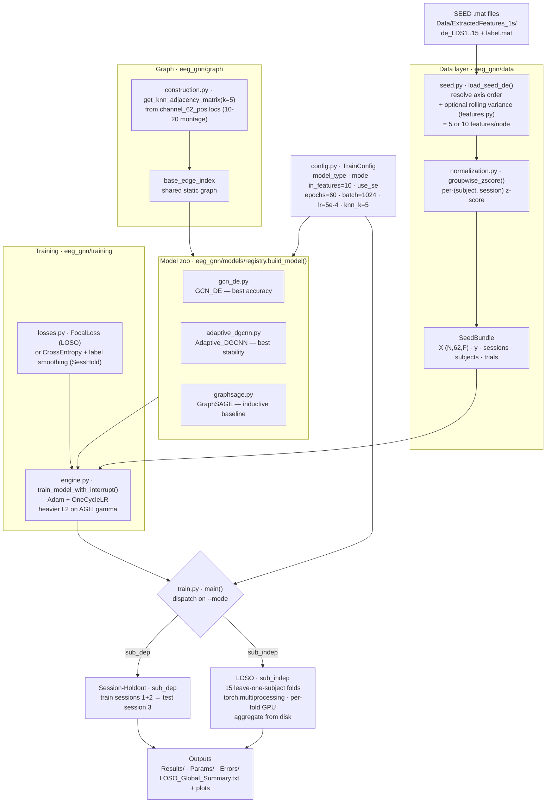
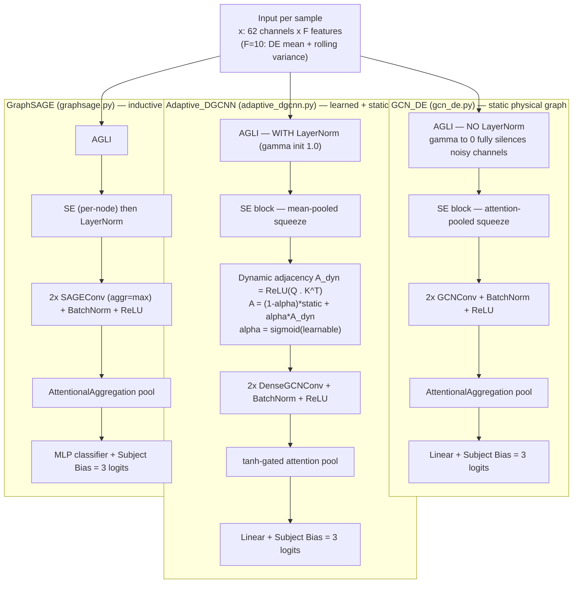

# Architecture Map

Visual map of the `eeg_gnn` pipeline (post-refactor `src/` package). Renders natively
on GitHub. For *why* the architecture looks like this, see [`RESEARCH_HISTORY.md`](../RESEARCH_HISTORY.md);
for *how to run it*, see the [README](../README.md).

> The older `docs/architecture_map.txt` describes the **pre-refactor** layout
> (`Models/var_B.py`, `train_de.py`, "no package structure") and is now stale — this
> file supersedes it.

---

## 1 · Data & training pipeline

---

## 2 · The three model forward passes

All three share the author's signature blocks — **AGLI** (learnable per-channel/per-band
input gate), an **SE block** (frequency-band recalibration), and a **Subject Bias**
embedding added to the logits — but differ in how they build and use the graph.

---

## 3 · One-line component index

| Layer | File | Responsibility |
| :-- | :-- | :-- |
| Entry point | `train.py` | CLI → load data → build graph → dispatch on `--mode` |
| Config | `config.py` | `TrainConfig` dataclass: all hyperparameters + paths |
| Data | `data/seed.py` | Load SEED DE features → `SeedBundle` |
| Data | `data/features.py` | Rolling-variance channel (5 → 10 features) |
| Data | `data/normalization.py` | Per-(subject, session) z-score |
| Graph | `graph/construction.py` | k-NN electrode graph from the 10-20 montage |
| Models | `models/registry.py` | `build_model()` factory dispatched by `--model_type` |
| Models | `models/{gcn_de,adaptive_dgcnn,graphsage}.py` | The three GNN paradigms |
| Training | `training/engine.py` | Train/eval loop, checkpointing, interrupt-safe save |
| Training | `training/losses.py` | `FocalLoss` (LOSO) |
